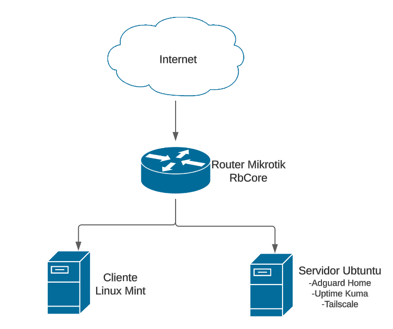

[← Volver al inicio](../index.md)

# 1. Descripción detallada de la topología de red

Este proyecto final trata en la creación e implementación de una red corporativa virtualizada utilizando VirtualBox. La red ha sido diseñada para simular un ambiente empresarial que incluye componentes clave como un router MikroTik, un servidor Ubuntu con Docker y un cliente con Linux con interfaz gráfica todos vinculados mediante redes internas.

## Topología de Red

El tipo de topología empleada en este proyecto es de tipo estrella, en la cual todos los dispositivos están conectados al router MikroTik que funciona como el centro de la red. 

### Estructura de la Topología

**MikroTik Router:**  
Es el encargada de gestionar el tráfico entre los demás dispositivos.

**Servidor Ubuntu:**  
Este se encarga de ejecutar los servicios mediante los contenedores Docker.
En este contenedor se instalan los siguientes servicios:
- **Adguard Home:** Se utiliza para configurar el DNS y sus respectivos filtros
- **TailScale:** Se utiliza para configurar la VPN
- **Uptime Kuma:** Se utiliza para el monitoreo de los dispositivos y enviar notificaciones

**Cliente Linux:**  
Se utiliza para verificar la conectividad y la disponibilidad de servicios.

Esta estructura simplifica la gestión y logra representar un diseño comúnmente utilizado en las redes empresariales reales.

