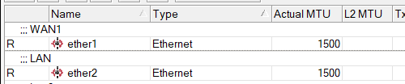
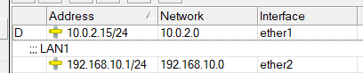
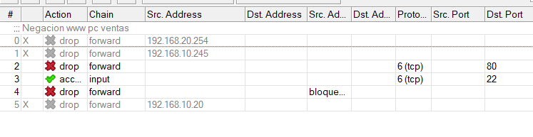

[← Volver al inicio](../index.md)
# 3. Configuración del Router MikroTik en VirtualBox

## 1. Configuración Inicial del Router

### 1.1. Especificaciones Técnicas

- **Sistema Operativo:** MikroTik Cloud Hosted Router (CHR)
- **CPU:** 1 núcleo
- **RAM:** 1024 MB
- **Red:** Configurada como Red Interna en VirtualBox

### 1.2. Acceso al Router

- Se utilizó **WinBox** para conectarse al router.
- La conexión se realizó mediante la **dirección MAC** del router desde un cliente Linux.

## 2. Configuración de Interfaces y Direcciones IP

### 2.1. Asignación de Interfaces Ethernet

- **ether1:** Conectada al servidor Ubuntu
- **ether2:** Conectada al cliente Linux



Debido a que la interfaz usada por el servidor es NAT, VB automáticamente le asigna una, la cual es `10.0.2.15/24` que trabaja en la red `10.0.2.0`. Y para la ether, se le configura manualmente la dirección `192.168.10.1/24`, que trabaja en la red `192.168.10.0`.



## 2.2. Configuración de DHCP Server

Se implementaron servidores DHCP para asignar direcciones IP automáticamente a los dispositivos conectados en la red.

En este caso se configura para `eher2` de la siguiente manera: 
```
DHCP Address Space: 192.168.10.0/24 
Gateway for DHCP Network: 192.168.10.1 
```
## 2.3 Asignación de IP estática al servidor
Con el propósito de que el servidor Zentyal siempre tenga la misma IP, se le establece que sea de tipo estática para que esta nunca cambie y no presente problemas en las configuraciones a futuro.
Para esto, nos dirigimos a la sección `IP` -> `DHCP Server` -> `Leases`, buscamos el servidor y presionamos `Make Static`. En este caso, nos había brindado la IP `192.168.10.254`.


## 3. Configuración de Firewall

Se aplicaron reglas básicas de firewall para garantizar la seguridad de la red.

### 4.1. Reglas Principales

Para iniciar con esta configuracion nos dirigimos a `IP` -> `Firewall`.
Y lo configuramos de la siguiente forma:


1. **Regla 0 (deshabilitada):** Bloqueaba todo el tráfico desde `192.168.20.254` al pasar por el router.
2. **Regla 1:** Bloquea acceso HTTP (puerto 80) desde `192.168.10.245` hacia internet.
3. **Regla 2:** Bloquea tráfico TCP de reenvío (forward) hacia un destino no visible.
4. **Regla 3:** Permite conexiones SSH (puerto 22) directamente al router.
5. **Regla 4:** Bloquea tráfico de reenvío desde una IP (incompleta en la vista).
6. **Regla 5 (deshabilitada):** Bloqueaba todo el tráfico desde `192.168.10.20` al pasar por el router.


