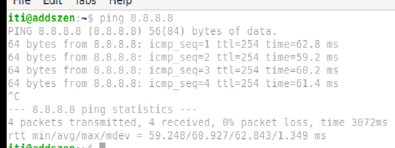

[← Volver al inicio](../index.md)
# 4. Instalación y Configuración de Ubuntu Server

## 1. Sistema operativo a utilizar
Para la instalación se utiliza el archivo `.ova` brindado por el docente, el cual ya tiene configurados algunos servicios previamente, que se utilizarán en el proyecto.

## 2. Configuración de la Maquina Virtual
Para esta ocasión, se le asignarán a la máquina virtual los siguientes recursos y configuraciones:
- **RAM:** 5034 MB  
- **CPU:** 2  
- **Red:**  
  - **Adaptador 1:**  
    - Red Interna  
    - Intnet

## 3. Inicio de sesión
Para iniciar sesión debemos ingresar con el usuario `iti` y la contraseña `admin`.

## 4. Verificación de conexión a internet
Para verificar conexión a internet hacemos ping a cualquier sitio, en este caso `8.8.8.8`.

