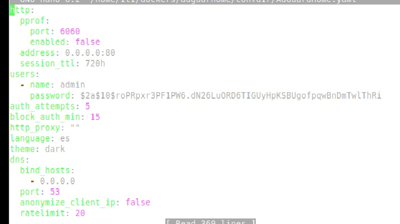
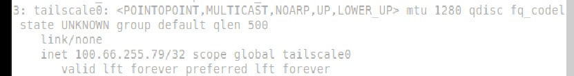

[← Volver al inicio](../index.md)

## Implementación de Docker y Servicios en el Servidor Ubuntu

Para gestionar los distintos servicios de red de manera eficiente, se instaló **Docker** en el servidor Ubuntu (Zentyal). Esta plataforma permite ejecutar aplicaciones en contenedores aislados, lo cual mejora el rendimiento, la seguridad y la portabilidad de los servicios. A continuación, se describe paso a paso cómo se instaló Docker, Docker Compose y cómo se desplegó el servicio de **AdGuard Home**, que funcionará como servidor DNS de la red.


### 1. Instalación de Docker

#### Paso 1: Preparar el sistema

Antes de instalar Docker, se actualizaron los repositorios y se instalaron herramientas necesarias para manejar claves GPG y conexiones HTTPS:

```bash
sudo apt update && sudo apt install -y ca-certificates curl gnupg
```

#### Paso 2: Configurar el repositorio oficial

1. Crear un directorio seguro para almacenar claves GPG:

```bash
sudo install -m 0755 -d /etc/apt/keyrings
```

2. Descargar y almacenar la clave oficial de Docker:

```bash
curl -fsSL https://download.docker.com/linux/ubuntu/gpg | sudo gpg --dearmor -o /etc/apt/keyrings/docker.asc
```

3. Ajustar los permisos para permitir su lectura:

```bash
sudo chmod a+r /etc/apt/keyrings/docker.asc
```

#### Paso 3: Agregar la fuente de instalación

Se añadió el repositorio estable de Docker correspondiente a la versión de Ubuntu instalada:

```bash
echo "deb [arch=$(dpkg --print-architecture) signed-by=/etc/apt/keyrings/docker.asc] https://download.docker.com/linux/ubuntu $(lsb_release -cs) stable" | sudo tee /etc/apt/sources.list.d/docker.list > /dev/null
```

#### Paso 4: Instalar Docker

Una vez agregado el repositorio, se actualizaron los paquetes del sistema y se instalaron Docker y sus componentes:

```bash
sudo apt update
sudo apt install -y docker-ce docker-ce-cli containerd.io docker-buildx-plugin docker-compose-plugin
```


### 2. Configuración Básica

#### Paso 5: Permisos de usuario

Para evitar tener que usar `sudo` en cada comando Docker, se añadió el usuario actual al grupo `docker`:

```bash
sudo usermod -aG docker $USER
newgrp docker
```

#### Paso 6: Verificación de instalación

Se probó la instalación ejecutando un contenedor de prueba:

```bash
docker run hello-world
```

Este comando descarga una imagen de prueba que devuelve un mensaje de éxito si Docker está funcionando correctamente.


### 3. Instalación de Docker Compose (versión independiente)

Aunque Docker ya incluye `docker compose` como plugin, se instaló la versión clásica de Docker Compose por compatibilidad:

```bash
sudo curl -L "https://github.com/docker/compose/releases/latest/download/docker-compose-$(uname -s)-$(uname -m)" -o /usr/local/bin/docker-compose
sudo chmod +x /usr/local/bin/docker-compose
```

Verificación de la instalación:

```bash
docker-compose --version
```


## AdGuard Home – Servidor DNS con Bloqueo de Contenido

AdGuard Home es una herramienta que actúa como **servidor DNS personalizado**, capaz de bloquear anuncios, rastreadores, contenido malicioso y sitios distractores en toda la red. Su funcionamiento se basa en interceptar las solicitudes DNS de los dispositivos conectados y aplicar filtros definidos por el administrador.


### Despliegue y configuración del contenedor Docker

#### Paso 1: Liberar el puerto 53 (si está ocupado por BIND u otro servicio)

Editar la configuración de BIND si está activo en el sistema:

```bash
sudo nano /etc/bind/named.conf.options
```

Comentar o eliminar las líneas relacionadas con `listen-on port 53;`, luego reiniciar el servicio:

```bash
sudo systemctl restart bind9
sudo lsof -i :53
```

#### Paso 2: Crear directorios para persistencia

Estos directorios almacenarán la configuración y datos de AdGuard, incluso si se reinicia el contenedor:

```bash
mkdir -p ~/dockers/adguard-home/confdir ~/dockers/adguard-home/workdir
```

#### Paso 3: Ejecutar el contenedor de AdGuard Home

```bash
docker run -d --name adguardhome \
  -v ~/dockers/adguard-home/workdir:/opt/adguardhome/work \
  -v ~/dockers/adguard-home/confdir:/opt/adguardhome/conf \
  -p 53:53/tcp -p 53:53/udp -p 5000:3000 \
  adguard/adguardhome
```

Esto expone:

* **Puerto 53** para resolver las solicitudes DNS.
* **Puerto 5000** para acceder a la interfaz web de administración.

#### Paso 4: Editar el archivo de configuración

Si es necesario ajustar el puerto o dirección de escucha de la interfaz web:

```bash
sudo nano ~/dockers/adguard-home/confdir/AdGuardHome.yaml
```


Cambiar el parámetro `address` de `web_config` a `:5000`.

#### Paso 5: Reiniciar el contenedor para aplicar cambios

```bash
docker restart adguardhome
```

#### Paso 6: Acceder a la interfaz web

Desde un navegador en la misma red, se accede a:

```
http://<IP-del-servidor>:5000
```

Aquí se configura el usuario administrador, contraseñas y parámetros iniciales del servicio.


# Implementación de Uptime Kuma para Monitoreo de Red

## Proceso de Instalación y Configuración

### Preparación del entorno:
Se creó un directorio dedicado para almacenar los datos persistentes:

```bash
mkdir -p /home/iti/dockers/uptimekuma
```

### Despliegue del contenedor:

Se ejecutó el siguiente comando para iniciar el servicio:

```bash
sudo docker run -d --restart=always -p 3001:3001 \
-v /home/iti/dockers/uptimekuma:/app/data \
--name uptime-kumacaac \
louislam/uptime-kuma:1
```

### Parámetros clave:

* `-p 3001:3001`: Asignación del puerto para acceso web
* `-v /home/iti/dockers/uptimekuma:/app/data`: Persistencia de datos
* `--restart=always`: Reinicio automático del servicio

### Descarga e inicialización:

* El sistema descargó automáticamente la imagen oficial .
* Se completó la descarga de la imagen Docker.
* El contenedor se inició correctamente con estado "healthy".

### Verificación del servicio:

Mediante `docker ps` 

### Configuración de red:

Se identificó la dirección Tailscale asignada con el comando:

```bash
ip a

tailscale ip
```
tailscale ip



Esta dirección permite acceso remoto seguro a través de la VPN.


