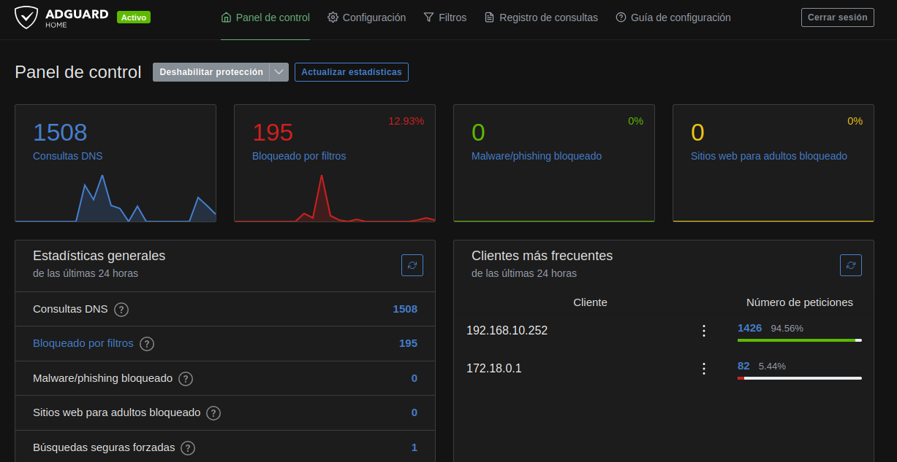
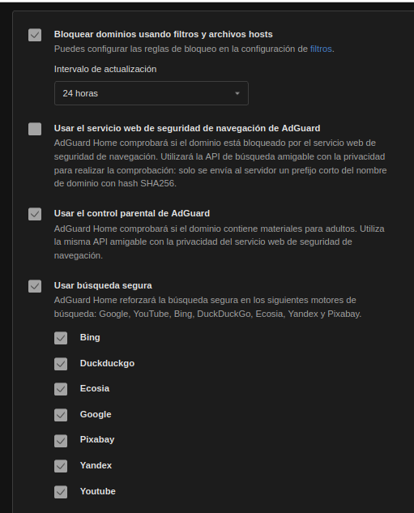
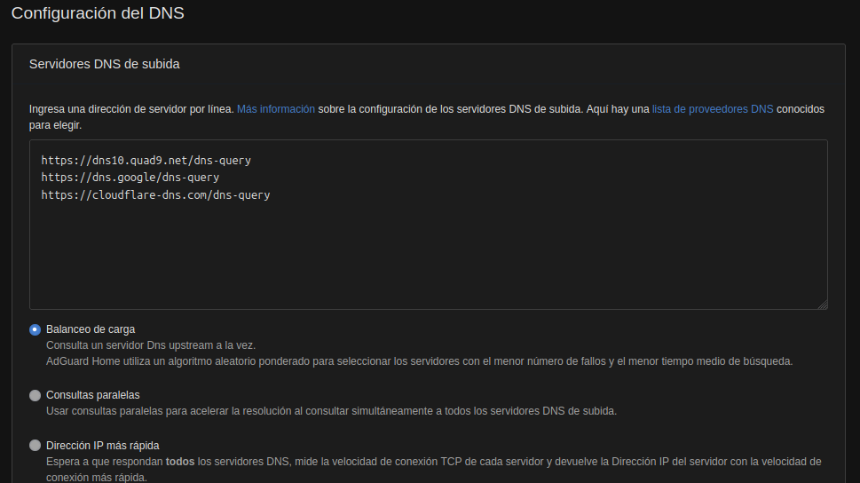
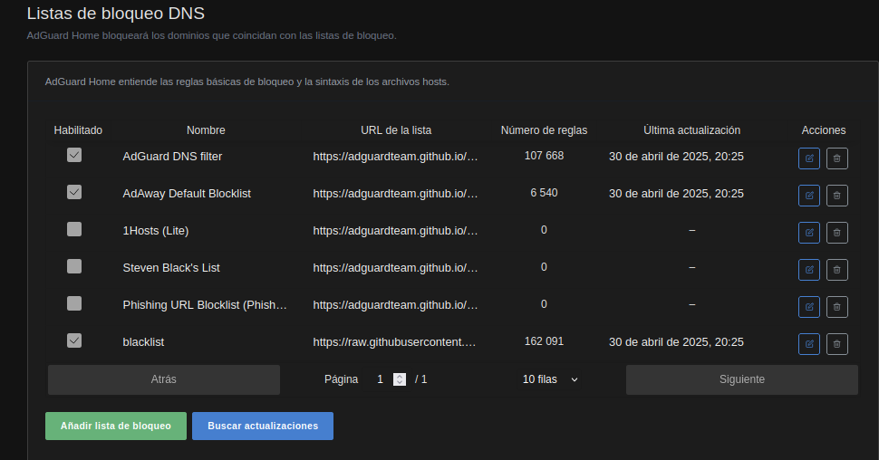
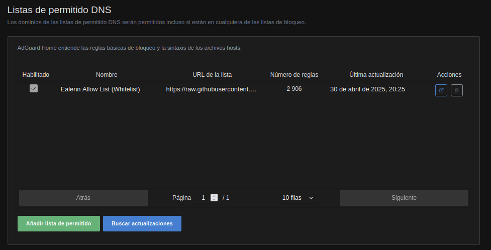
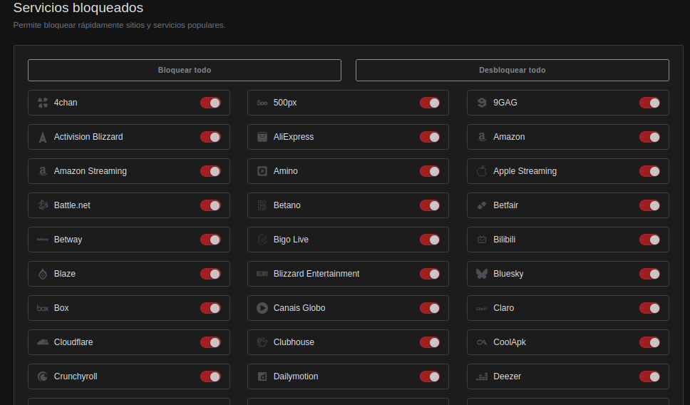
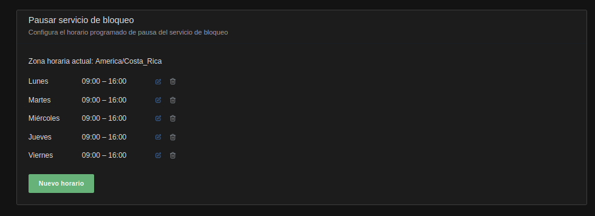
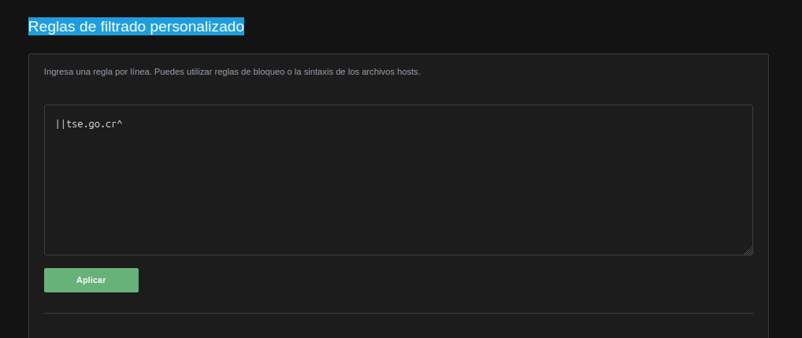
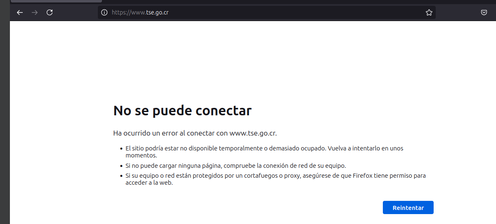

[← Volver al inicio](../index.md)

# 6. Implementación del DNS con Adguard Home
Esta configuración se hizo en el servidor Ubuntu Zentyal, con el propósito de configurar el DNS y así poder controlar el manejo de paquetes del proyecto, por ejemplo, el control de la publicidad y el no ingreso a sitios fraudulentos.

## Configuración Inicial de AdGuard Home

Lo primero que debemos hacer es iniciar sesión en AdGuard Home desde un navegador web. Para esto seguimos estos pasos:

1. Abrimos un navegador y accedemos a la siguiente dirección:  
   `http://192.168.10.254`.

2. Ingresamos con las siguientes credenciales:  
   - **Usuario:** `admin`  
   - **Contraseña:** `admin123`

Al iniciar sesión, nos saldrá la siguiente interfaz:

Ahora procedemos a hacer varias configuraciones importantes para mejorar la seguridad en el servidor.

### Configuración General:

Estas configuraciones de AdGuard Home permiten bloquear dominios utilizando listas de filtros actualizadas cada 24 horas, lo que protege contra publicidad, rastreadores y sitios maliciosos. Además, se ha activado el control parental para bloquear contenido para adultos y la búsqueda segura en motores como Google, YouTube y Bing, evitando resultados explícitos. No se ha activado la opción de verificación en tiempo real mediante la API de seguridad de navegación de AdGuard, lo que indica una preferencia por mantener más control local y privacidad en las consultas.

### Configuración del DNS:

Esta configuración de DNS en AdGuard Home permite que todas las consultas de nombres de dominio que no estén bloqueadas localmente se envíen de forma segura a servidores externos como Quad9, Google y Cloudflare utilizando DNS sobre HTTPS (DoH), lo que garantiza privacidad y protección contra amenazas. Además, se ha activado el balanceo de carga, por lo que AdGuard seleccionará automáticamente el servidor más confiable y rápido en cada momento, optimizando la velocidad y estabilidad de la navegación en toda la red.

## Filtros

### Listas de Bloqueo DNS

Esta configuración de AdGuard Home muestra las listas de bloqueo DNS activas, que se encargan de filtrar y bloquear automáticamente dominios relacionados con publicidad, rastreadores, malware y otros contenidos no deseados. En la imagen se observa que están habilitadas listas como "AdGuard DNS filter", "AdAway Default Blocklist" y una personalizada llamada "blacklist", cada una con miles de reglas que se actualizan periódicamente desde fuentes externas. Estas listas permiten a AdGuard aplicar bloqueos a nivel de red, mejorando la privacidad, seguridad y experiencia de navegación de todos los dispositivos conectados.

### Listas de Permitidos DNS

Esta configuración de AdGuard Home muestra una lista de permitido DNS (también conocida como whitelist), que contiene dominios que siempre serán permitidos, incluso si aparecen en alguna lista de bloqueo. En este caso, está habilitada la lista "Ealenn Allow List (Whitelist)", la cual incluye 2,906 dominios confiables y fue actualizada por última vez el 30 de abril de 2025. Esta función es útil para evitar bloqueos accidentales de sitios importantes o de confianza, garantizando que ciertos dominios no sean filtrados por error.

### Servicios Bloqueados

Estas configuraciones de AdGuard Home permiten gestionar el bloqueo de servicios y establecer horarios en los que dicho bloqueo se pausa automáticamente. En la primera imagen se muestra la sección de "Servicios bloqueados", donde se han activado los interruptores para bloquear el acceso a una amplia lista de servicios populares como Amazon, 4chan, Cloudflare, Crunchyroll, Apple Streaming, entre muchos otros. Esto impide que los dispositivos conectados a la red accedan a estos servicios, lo que puede ser útil para controlar el uso de internet en entornos escolares, laborales o familiares.

Esta otra imagen muestra la sección de "Pausar servicio de bloqueo", donde se ha configurado un horario de pausa del bloqueo de lunes a viernes, de 09:00 a 16:00. Esto significa que durante esas horas el sistema desactiva temporalmente las restricciones, permitiendo el acceso a todos los servicios bloqueados, y luego los vuelve a bloquear fuera del horario establecido. Esta funcionalidad es útil para aplicar controles de tiempo sin necesidad de intervenir manualmente cada día.

### Reglas de Filtrado Personalizado

En la sección de Reglas de filtrado personalizado de AdGuard Home, se ha configurado manualmente el bloqueo del dominio `tse.go.cr` mediante la regla `||tse.go.cr^`. Esta sintaxis específica indica que se bloqueará todo el tráfico dirigido a ese dominio y a cualquiera de sus subdominios. Al aplicar esta regla, AdGuard evitará que cualquier dispositivo conectado a la red pueda acceder a servicios relacionados con el sitio web del Tribunal Supremo de Elecciones de Costa Rica. Esta opción es útil para establecer restricciones específicas que no estén incluidas en las listas de bloqueo generales.

