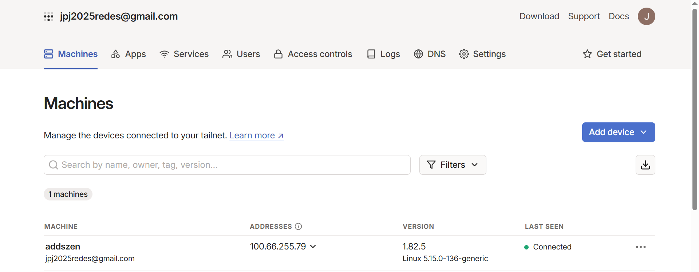
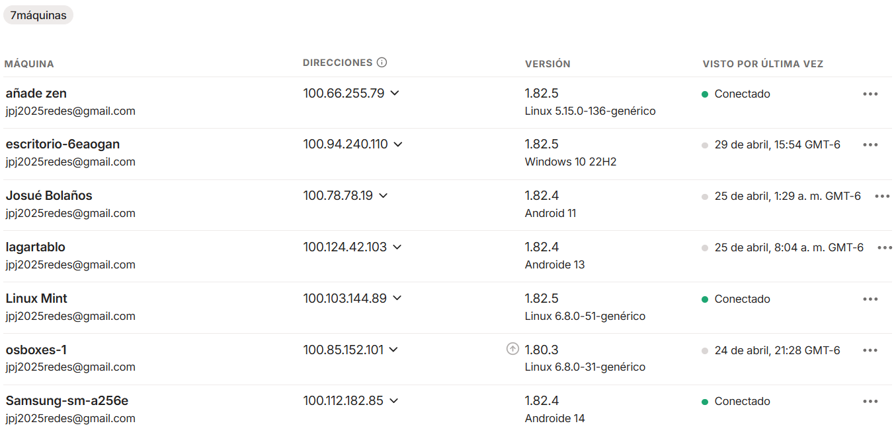

[← Volver al inicio](../index.md)

# 7. Implementación de VPN con Tailscale

En el presente proyecto se optó por implementar **Tailscale**, una solución moderna de red privada virtual (VPN) basada en el protocolo **WireGuard**, reconocido por su eficiencia y seguridad. Esta elección se fundamenta en la facilidad de configuración que ofrece Tailscale, eliminando la complejidad habitual de las VPN tradicionales y permitiendo establecer redes privadas seguras entre múltiples dispositivos de manera rápida y escalable.

---

## Configuración Inicial de Tailscale

El proceso de configuración comienza con el registro de una cuenta y la preparación de los dispositivos que formarán parte de la red privada.

### Pasos iniciales:

1. Abrir un navegador web y acceder al sitio oficial:  
   [https://login.tailscale.com](https://login.tailscale.com)

2. Registrarse utilizando una cuenta de Google.  
   > **Recomendación:** Crear un correo electrónico exclusivo para la gestión del equipo de red.  
   > En este caso nosotros usamos: `jpj2025redes@gmail.com`

3. Iniciar sesión para acceder al panel principal de administración de Tailscale:

   

---

## Instalación en Servidor Ubuntu

Para implementar Tailscale en un servidor con sistema operativo **Ubuntu**, se deben seguir los siguientes pasos:

1. Ejecutar el siguiente comando en la terminal para instalar Tailscale:

   ```bash
   curl -fsSL https://tailscale.com/install.sh | sh
   ```

2. Una vez completada la instalación, iniciar Tailscale con el siguiente comando:

   ```bash
   sudo tailscale up
   ```

   Al ejecutar este comando, se generará un enlace para autenticar el dispositivo en la cuenta del proyecto.


---

## Integración de Dispositivos a la Red

Se integraron un total de **siete dispositivos** a la red privada establecida con Tailscale, conformando la siguiente infraestructura:

- **1 servidor** Linux Zentyal.
- **2 clientes Linux** con Linux Mint y Lubuntu.
- **3 teléfonos móviles** con sistema operativo Android.

### Proceso de integración:

#### Equipos con Linux:
- Instalar Tailscale utilizando el script oficial.
- Ejecutar `sudo tailscale up`.
- Autenticar el dispositivo mediante el enlace proporcionado por el comando.

#### Dispositivos móviles Android:
- Descargar la aplicación oficial de Tailscale desde **Google Play Store**.
- Iniciar sesión con la cuenta del proyecto (`jpj2025redes@gmail.com`).
- Activar la conexión VPN desde los ajustes del sistema para integrarse automáticamente a la red.

---

Con esta implementación, se logró establecer una red privada segura, dinámica y administrable de forma centralizada, facilitando la comunicación entre todos los dispositivos conectados, independientemente de su sistema operativo o ubicación geográfica.
