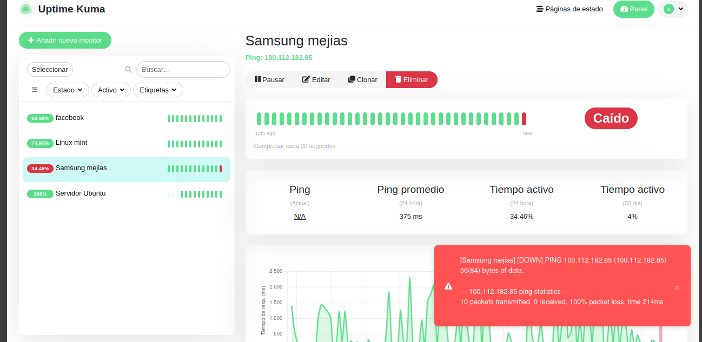
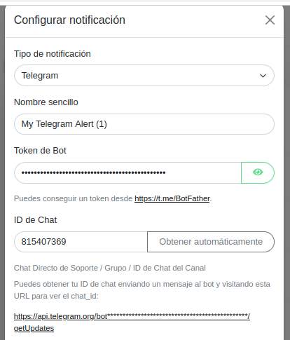
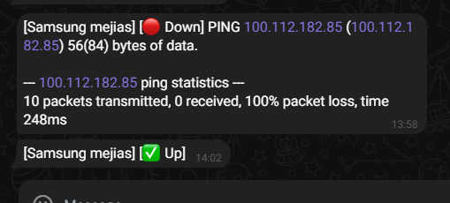

[← Volver al inicio](../index.md)

# 8. Configuración del Uptime Kuma (Monitoreo)
Este sistema está alojado en un Docker en Ubuntu Server. La idea es monitorear los sitios conectados para recibir notificaciones cuando estos se caen y vuelven a estar en línea a través de un chat de Telegram.


### 1. Instalación de Uptime Kuma usando Docker

La instalación se realizó en el servidor Ubuntu (`192.168.10.254`) mediante Docker Compose.

**Archivo `docker-compose.yml`:**
```yaml
version: '3'
services:
  uptime-kuma:
    image: louislam/uptime-kuma
    container_name: uptime-kuma
    volumes:
      - ./uptime-kuma-data:/app/data
    ports:
      - "3001:3001"
    restart: always
```

**Pasos ejecutados:**
```bash
mkdir uptime-kuma
cd uptime-kuma
nano docker-compose.yml
docker compose up -d
```

La interfaz quedó disponible en la IP del servidor:
```
http://192.168.10.254:3001
```

### 2. Configuración de Monitores

Una vez iniciado el web,se configuraron varios monitores para verificar la disponibilidad de los dispositivos vinculados:

- **Monitor tipo Ping** para verificar disponibilidad de un dispositivo cliente conectado a la red.

Para asegurarse de que los servicios eran accesibles por HTTP, se utilizó el comando `nmap` desde el servidor:
```bash
nmap 192.168.10.254 -p 1-10000
```
Esto permitió identificar los puertos abiertos y activos para monitorear correctamente.


### 3. Funcionamiento y Visualización

En Uptime Kuma se realizan chequeos a intervalos definidos y en la interfaz podemos observar:

- Los servicios **activos** aparecen como 🟢 **en línea**.
- Los servicios **caídos** se muestran como 🔴 **fuera de línea**.
- Se guarda un **historial detallado** con:
  - Tiempos de actividad e inactividad.
  - Estadísticas de respuesta.
  - Reportes semanales y mensuales.



### 4. Notificaciones por Telegram

Se configuró un canal de notificaciones por **Telegram** para recibir alertas automáticas cada vez que un servicio se cae o se recupera:

**Pasos:**
1. Se creó un bot de Telegram
2. Se obtuvo el **Token de API** y el **Chat ID**.
3. En Uptime Kuma > Ajustes > Notificaciones:
   - Se seleccionó **Telegram**.
   - Se ingresaron los datos del bot y se probó la notificación correctamente.



**Mensajes de desconexión y conexión**
