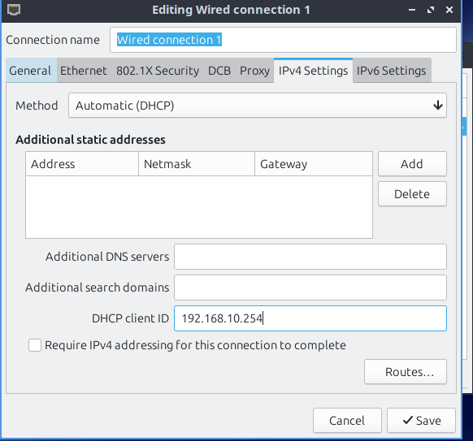
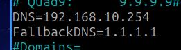
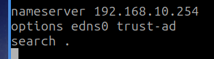
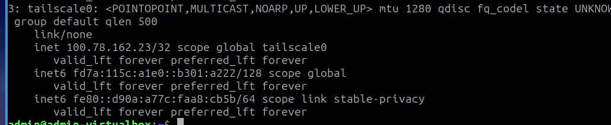
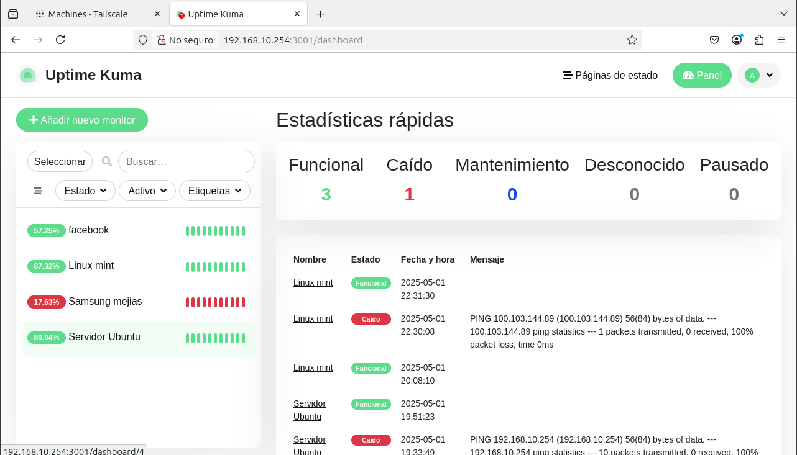

[← Volver al inicio](../index.md)

# 8. Configuración del Cliente

Para esto, configuramos dos clientes de distintas distribuciones de Linux, a los que se les configura para que puedan utilizar los servicios de AdGuard Home, Uptime Kuma y Tailscale.

## 1. Configuraciones de las VM de los clientes

**Linux mint:**
- **RAM:** 2048 MB 
- **CPU:** 2  
- **Red:**  
  - **Adaptador 1:**  
    - Red Interna  
    - Intnet

**Linux Lubuntu:**
- **RAM:** 1024 MB 
- **CPU:** 1
- **Red:**  
  - **Adaptador 1:**  
    - Red Interna  
    - Intnet

## 2. Configuración de los servicios

Para iniciar, es importante que primeramente revisemos que haya conexión a internet, por lo que le haremos ping a un sitio web. Si esta nos devuelve que está haciendo ping, continuamos...

### 2.1 Configuración de Adguard Home

Luego procedemos a las configuraciones de red de la máquina y nos dirigimos a `IPv4` y configuramos el `DNS` de acuerdo con la IP de nuestro servidor.


Ahora nos dirigimos al archivo `/etc/systemd/resolved.conf` y lo modificamos de la siguiente forma:


Ahora nos dirigimos al archivo `/etc/resolv.conf` y lo modificamos de la siguiente forma con la ip del servidor.


Y por último, reiniciamos el servicio:
```bash
sudo systemctl restart systemd-resolved.service
```

### 2.2 Configuración del Tailscale
Para configurar el Tailscale, nos dirigimos a la consola y lanzamos el siguiente comando:
```bash
curl -fsSL https://tailscale.com/install.sh | sh
```

Una vez instalado, lanzamos el comando `tailscale up` y nos lanzará un enlace al que debemos acceder y conectarnos; en el caso de nosotros, lo hicimos con Google.
Ahora, para verificar, escribimos el comando `ip a`, y nos debe aparecer la IP de Tailscale.


### 2.3 Configuración del Uptime Kuma

Para acceder al Uptime Kuma es sumamente sencillo, solo debemos poner en el navegador la IP de nuestro servidor `192.168.10.254` junto al puerto `:3001`, luego nos logueamos con el usuario `admin` y la contraseña `admin123`:
